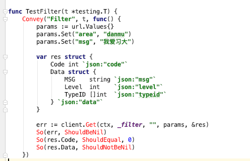

## Go实战项目介绍——降C站大型源码初析

#### 在知乎回答问题被删

#### 发文章(截图):

#### 也被要求审改。

### **fuck 知乎。**

### 重点

作为一名好奇心与上进心极强的宝宝，你以为这样就难倒我了？
其实这套代码，对于Go初学者来说，简直是个百宝箱。有基本的用户登录与管理模块，异地登录校验，搜索模块，推荐模块，分享模块，排行模块等等。

看到过滤模块，我要笑死了，这开发人员好可爱。

送开发人员一个笔芯。

